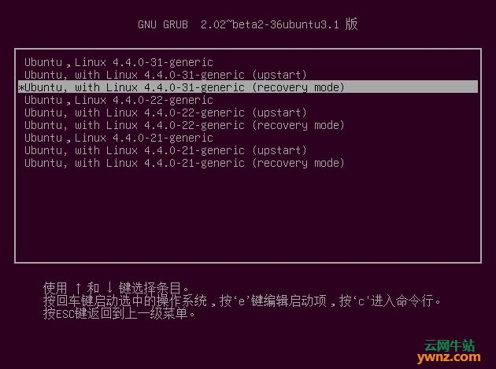
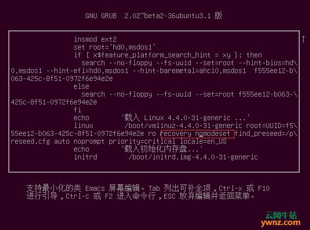

## 找回密码

1. 开机时一直按着shift键，进入像是windows bios界面一样的界面，选择`Ubuntu高级选项`

2. 选择第三个版本最高的Linux内核版本（注释：`recovery mode`是恢复模式。），如下图的位置，按【**e**】编辑启动项，不要按【Enter】，再重申一次，**不要按【Enter】**：

   

3. 按向下箭头往下翻，在倒数第五行找到【`recovery nomodeset`】并将之删除，然后下移一行，在行尾添加【`quiet splash rw init=/bin/bash`】（下图中的linux行尾，即locale=en_US quiet splash rw init=/bin/bash），按下F10：

   

4. 按下F10后进入到下面的界面，此时有两种选择：

   1. 你不知道你的用户名：输入`passwd `
   2. 知道用户名：输入`passwd 用户名`

5. 如返回`password updated successfully`即宣告成功

6. 重启 `shutdown -h now`

## 参考资料

1.[Ubuntu 16.04/18.04忘记登陆密码的解决方法](http://www.zztongyun.com/article/linux%E5%BF%98%E8%AE%B0%E7%99%BB%E5%BD%95%E5%AF%86%E7%A0%81)