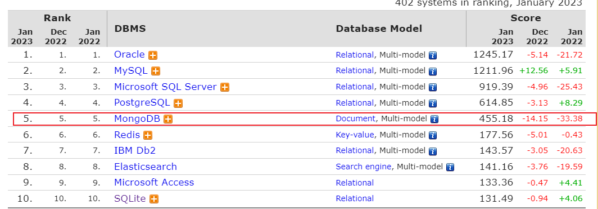

# 认识MongoDB 
## MongoDB 简介

> MongoDB是一个基于 分布式文件存储 的数据库（以JSON为数据模型，数据格式为BSON）属于NoSQL数据库，有C++ 编写，旨在为WEB应用提供可拓展的高性能数据存储解决方案。

[下载地址: https://www.mongodb.com/try/download/community](https://www.mongodb.com/try/download/community)

[查看数据库排行榜：https://db-engines.com/en/ranking](https://db-engines.com/en/ranking)

## MongoDB版本对比

| 版本 | 功能 |
| --- | --- |
| > v4.2.x | 支持多文档事务（分布式事务）分片场景 |
| v5.x |  |
| v6.x |  |

## MongoDB 相关概念
|  SQL 术语/概念 | MongoDB术语/概念 | 解释/说明|
| --- | --- | --- |
| database | database | 数据库 |
| table | collection | 数据库表/集合 |
| row | document | 数据记录行/文档 |
| column | field | 数据字段/域 |
| index | index | 索引 |
| table joins |   | 表连接,MongoDB不支持 |
|  | 嵌入文档 | MongoDB通过嵌入式文档来替代多表连接 |
| primary key | primary key | 主键,MongoDB自动将_id字段设置为主键 |

## MongoDB优势

1.  基于灵活的JSON文档模型，非常适合**敏捷开发**
2. 与生俱来的高可用、高拓展，适合**处理海量数据** （支持TP - PB数量级）

## MongoDB使用场景

1. 游戏场景：用户信息、装备、积分等
2. 物流信息：物流状态
3. 社交场景：GEO附近的人，地点相关
4. 物联网：终端接入信息、日志
5. 视频直播：用户信息，礼物信息等
6. 大数据应用：大数据存储系统、随时进行数据分析

## 什么情况可以选择MongoDB？
>在架构选型上，除了上述的三个特点外，如果你还犹豫是否要选择它？可以考虑以下的一些问题：

1. 应用不需要事务及复杂 join 支持
2. 新应用，需求会变，数据模型无法确定，想快速迭代开发
3. 应用需要2000-3000以上的读写QPS（更高也可以）
4. 应用需要TB甚至 PB 级别数据存储
5. 应用发展迅速，需要能快速水平扩展
6. 应用要求存储的数据不丢失
7. 应用需要99.999%高可用
8. 应用需要大量的地理位置查询、文本查询

如果上述有1个符合，可以考虑 MongoDB，匹配得越多，选择 MongoDB 越合适。

## MongoDB 的特点
1. 高性能
2. 高可用性
3. 高扩展性
4. 丰富的查询支持
5. 其他特点：如无模式（动态模式）、灵活的文档模型 

---
## 参考资料

[1] 尚硅谷.哔哩哔哩MongoDB基础入门到高级进阶，一套搞定mongodb..2019 https://www.bilibili.com/video/BV1bJ411x7mq

[2] 图灵课堂.哔哩哔哩.MongoDB全套入门教程.2022 https://www.bilibili.com/video/BV1FY411U7mbx