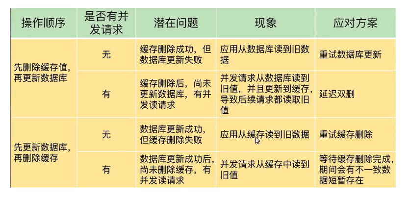

# Redis是为什么是单线程

单线程：工作线程是单线程（redis命令执行时单线程 get/set key），对于整个Redis来说是多线程

| 3.X                                                          | 4.X                                                          | 6.X                      |
| ------------------------------------------------------------ | ------------------------------------------------------------ | ------------------------ |
| 单线程                                                       | 处理**客户端请求**为单线程 混合持久化、多线程异步删除、集群数据同步 | 多线程 IO多线程链接 |
| 1.  数据结构简单 2. 避免锁的开销和上下文切换 3. 可以拥有很高的QPS | 为了解决阻塞（当存在bigkey时，导致阻塞）                     |                          |

