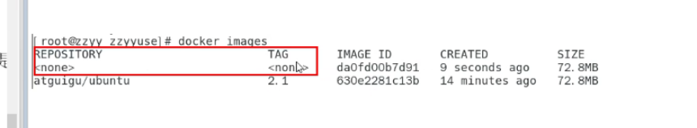
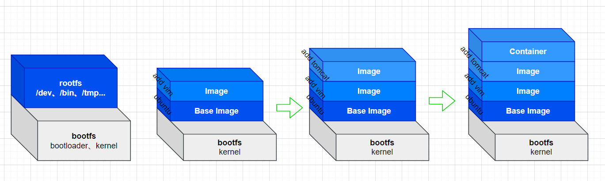

# Docker 入门
# 目录

## Docker 简介

`系统平滑，容器化虚拟技术`

官网：

[Empowering App Development for Developers | Docker](https://www.docker.com/)

仓库：

[Docker Hub Container Image Library | App Containerization](https://hub.docker.com/)

### docker 是什么

Go语言实现

一次镜像，处处运行

1. 更快速的应用交付和部署
2. 更便捷的升级和扩容
3. 更简单的系统运维
4. 更高效的计算资源利用

轻量，秒级启动

## Docker 安装

1.  docker 环境要求 
   -  环境
   centOS： 64位，内核>3.8 
```bash
## 查看CentOS 内核版本
cat /etc/redhat-release 
# CentOS Linux release 7.2.1511 (Core) 
uname -r
# 3.10.0-1160.11.1.el7.x86_64
```

2.  Doker 基本组成 
   1. 镜像（image）
   1. 容器（container）
   1. 仓库（repository）
3.  安装  
```bash
## 0. 术前准备
yum -y install gcc
yum -y install gcc-c++

## 1. 卸载现有的docker
sudo yum remove docker \
                  docker-client \
                  docker-client-latest \
                  docker-common \
                  docker-latest \
                  docker-latest-logrotate \
                  docker-logrotate \
                  docker-engine

## 2. 安装 utiles
sudo yum install -y yum-utils

## 3. 设置stable repository.【不推荐】
##（设置仓库，这个仓库是墙外 容易超时，）
## 经常报错： 
## [Error 14] curl#35 TCP connection reset by peer
## [Error 12] curl#35 - Timeout
sudo yum-config-manager \
    --add-repo \
    https://download.docker.com/linux/centos/docker-ce.repo
## 设置stable repository  【推荐使用】
sudo yum-config-manager \
    --add-repo \
		http://mirrors.aliyun.com/docker-ce/linux/centos/docker-ce.repo

## 4. 重建yum
yum makecache fast

## 5. 安装docker 引擎
sudo yum install docker-ce docker-ce-cli containerd.io

## 6. 启动 docker
sudo systemctl start docker

## 7. 查看docker 是否启动成功
ps ef|grep docker

## 8. 查看版本信息
docker version

## 9. hello world
sudo docker run hello-world
```

4.  卸载  
```bash
## 1. 停止docker
systemctl stop docker

## 2. 移除docker
sudo yum remove docker-ce docker-ce-cli containerd.io

## 3. 删除 本地资源
sudo rm -rf /var/lib/docker
sudo rm -rf /var/lib/containerd
```

5.  镜像
阿里云创建自己的镜像：[https://cr.console.aliyun.com/cn-qingdao/instances/mirrors](https://cr.console.aliyun.com/cn-qingdao/instances/mirrors)

```bash
## 修改daemon配置文件/etc/docker/daemon.json来使用加速器
sudo mkdir -p /etc/docker
## 添加配置文件
sudo tee /etc/docker/daemon.json <<-'EOF'
{
  "registry-mirrors": ["https://2t60jw5o.mirror.aliyuncs.com"]
}
EOF
## 重新加载daemon
sudo systemctl daemon-reload
## 重启docker
sudo systemctl restart docker


## 公共镜像
{
    "registry-mirrors": [
        "https://xxx.mirror.aliyuncs.com",
        "https://docker.mirrors.ustc.edu.cn",
        "http://f1361db2.m.daocloud.io",
        "https://registry.docker-cn.com"
    ]
}
```
## Docker 常用命令

### 帮助启动类命令

```bash
## 启动docker
systemctl start docker
## 停止
systemctl stop docker
## 重启
systemctl restart docker
## 查看docker状态
systemctl status docker
## 开机启动
systemctl enable docker
## 查看docker概要信息
docker info
## 查看docker总体帮助信息
docker --help
## 查看docker命令帮助信息
docker [OPTIONS] --help
```

### 镜像命令

1.  命令  
```bash
## 1. 查看镜像信息
## -a 查看所有镜像
## -q 查看镜像的id
## result：
## RESOSITORY： 表示镜像的仓库源
## TAG：镜像的标签（版本信息）
## IMAGE ID：镜像ID（md5串）
## CERATED：镜像创建时间
## SIZE：镜像大小
docker images [OPTIONS] 

## 2. 查询docker
## --limit 展示几条数据（默认25）
## result：
## NAME: 镜像名称                              
## DESCRIPTION ：镜像说明
## STARS：点赞数
## OFFICIAL：是否官方提供
## AUTOMATED：是否自动构建
docker search [OPTIONS] NAME

## 3. 拉去镜像到本地
docker pull [OPTIONS] NAME[:TAG|@DIGEST]

## 4. 查看镜像、容器、数据卷占用空间信息
docker system df

## 5. 删除镜像
## -f 强制删除
## docker rmi [TAG...] 批量删除镜像
## 多命令操作
## docker rmi -f ${docker images -aq} (查询出来所有的镜像 再全部删除)
docker rmi [OPTIONS] IMAGE [IMAGE...]
```

2.  面试题 
   1.  谈谈docker虚悬镜像是什么
   长什么样子?(**仓库名**和**标签**都是`none`的镜像成为虚悬镜像（dangling image) )

   

### 容器命令

`有镜像才能创建容器! 同一镜像可以run多个容器（如JAVA 中的new）！`

命令

```bash
## 1. 新建&启动容器
## --name="容器别名"
## -d 后台运行（守护式容器）
## -i 交互式运行容器（与-t 同时使用）
## -t 为容器分配一个伪终端（与-i 同时使用）
## -P 随机端口映射
## -p 指定端口映射 -p 80[宿主机]:8080[docker]
## e.g: docker run -it ubuntu bash
docker run [OPTIONS] IMAGE [COMMAND] [ARG...]
## 前台交互式启动
docker run it ubuntu
## 后台守护石启动(有些程序不支持后台启动)
docker run -d redis
############################### 重点 ########################################
## 重新进入容器交互
## exit不会导致容器停止，exec是在容器中打开新的终端【建议使用】
docker exec -it CONTAINER /bin/bash
##  exit 会导致容器停止，attach是直接进入容器，不新开终端
docker attach CONTAINER

#############################################################################

## 2. 列出正在运行容器
## -a 列出所有 正在运行的容器 + 历史上运行过的
## -l 显示最近创建的容器
## -n 显示最近n个创建的容器
## -q 静默模式，只显示容器编号
docker ps [OPTIONS]

## 3. 退出容器（run 进去的容器）
## exit exit退出，容器停止
## ctrl + p + q  退出，容器不停止

## 4. 启动已停止的容器
docker start [OPTIONS] CONTAINER [CONTAINER...]

## 5. 重启容器
docker resatr CONTAINER
## 6. 停止容器
docker stop CONTAINER
## 强制重启
docker kill CONTAINER
## 7. 删除容器
docker rm CONTAINER
## 强制删除容器
docker rm -f CONTAINER
## 批量删除
docker rm -f ${docker ps -a -q}
docker ps -a -q | xargs docker rm

## 查看容器日志
docker logs CONTAINER

## 查看容器内部运行的进程
docker top CONTAINER

## 查看容器内部细节
docker inspect NAME

## docker 文件复制 到主机
docker cp  CONTAINER:SRC_PATH DEST_PATH
## dockers 将主机文件复制到 容器内
docker cp SRC_PATH CONTAINER:DEST_PATH

## 导入导出容器
docker export CONTANER > xxx.tar
cat xxx.tar|docker import - 镜像用户/镜像名:镜像版本号
```

## Docker 镜像


### Docker镜像是什么

1.  是什么
镜像是一种**轻量级，可执行**的独立软件包，包含某软件所需要的所有内容：程序、配置依赖包、运行环境 
2.  分层的镜像
docker镜像实际是由一层一层的文件系统组成，成为UnionFS。
包含bootfs(boot file system)，rootfs。

**bootloader** 主要引导加载kernel，linux**刚启动**会**加载bootfs**文件系统，在docker镜像的**最底层**是引导文件系统**bootfs**。这一层与linux/unix一样，包含boot加载器内核，**当boot加载完成后**，整个内核就在内存中，此时内存的使用权就由bootfs交给内核，此时系统就**会卸载bootfs**。
**rootfs** 在 bootfs 之上，包含典型的linux系统中的标准目录和文件。rootfs就是各个不同的操作系统发行版。 
3.  UnionFS（联合文件系统）
一种分层、轻量级并且高性能的文件系统。
支持**对文件系统的修改作为一次提交来一层层的堆叠**。同时将不同目录挂载到同一个虚拟文件系统下。
UnionFS是docker镜像的基础，镜像可以通过分层来进行继承，基于基础镜像（没有父镜像），可以制作各种具体的应用镜像
为什么docker相对于linux发行版小？
因为docker是一个精简版的OS，底层直接使用Host的kernel，自己只需要rootfs就行了（包含最基础的命令、工具和程序）
docker与不同的linux发行版，bootfs基本是一致的，rootfs不同而已 
4.  Docker镜像加载原理 
5.  为什么Docker镜像采用分层结构
镜像分层最大的好处就是**共享资源**，方便复制迁移——**复用**。
每一层都可以被继承。 

### 重点

**Docker镜像层都是只读的，容器层是可以的。**

### Docker镜像commit操作

堆叠镜像使用。

```bash
## 提交镜像
docker commit -m="commit msg" -a="user name" CANTAINER 镜像用户/镜像名:镜像版本号
```

## 本地镜像发布到阿里云

[https://cr.console.aliyun.com/repository/cn-qingdao/xes/ubuntu/details](https://cr.console.aliyun.com/repository/cn-qingdao/xes/ubuntu/details)

## 本地镜像发布到私有库

```bash
## 1、拉取docker registry 搭建私有库
docker pull registry

## 2. 运行registry
## -v 映射数据卷 宿主机目录:容器目录
##  --privileged=true 开启数据卷权限
docker run -d -p 5000:5000 -v /usr/myregistry/:/tmp/registry --privileged=true registry

## 3.验证registry 内是否有镜像
curl -XGET http://127.0.0.1:5000/v2/_catalog

## 4. 把需要上传的库打标签
## xes/test-ubuntu:1.0.1         -> 本地镜像名称
## 127.0.0.1:5000/myubuntu:1.0.2 -> IP:PORT/NAME:TAG
docker tag xes/test-ubuntu:1.0.1 127.0.0.1:5000/myubuntu:1.0.2

## 5. push
docker push 127.0.0.1:5000/myubuntu

## 5.0 registry 如果不支持http上传 那么需要修改daemon.json
{
  "registry-mirrors": ["https://xxxx.mirror.aliyuncs.com"],
	"insecure-registries":["127.0.0.1:5000"]
}
## 修改配置文件后 须重新启动docker
systemctl restart docker
systemctl status docker
```

## Docker 容器数据卷

如果不加 `--privileged=true`，可能会出现：`cannot open directory:Permission denied`

CentOS7 安全模块加强，不加--privileged=true，container内的root只是外部的一个普通用户权限

```bash
docker run -it --privileged=true -v 宿主机目录:容器内目录 CANTAINER

## e.g 
docker run -d -p 5000:5000 -v /usr/myregistry/:/tmp/registry --privileged=true registry
## 如果不加 -v 那么仓库被常见在容器的/var/lib/registry,建议自行用数据卷映射，方便联调

## 添加容器内卷的读取权限
## 默认:rw (可不写) 一下两种等价
docker run -d -p 5000:5000 -v /usr/myregistry/:/tmp/registry --privileged=true registry
docker run -d -p 5000:5000 -v /usr/myregistry/:/tmp/registry:rw --privileged=true registry
## 只读:ro , 此时宿主机可写入内容到容器，容器可读 但不能更改
docker run -d -p 5000:5000 -v /usr/myregistry/:/tmp/registry:ro --privileged=true registry

## 继承父容器的数据卷
## 一处更改 处处更改
## 容器死，数据改，容器活，数据同步最近
docker run -it --privileged=true --volumes-from PRE-CONTAINER --name=u2 ubuntu
```

### 数据卷是什么

卷就是目录/文件，存在与一个或多个容器中，由docker挂载到容器，不属于unionFS（联合文件系统），因此能绕过UnionFS提供一些用于**持续存储或共享数据的特征**。卷的设计目的就是**数据的持久化**，**独立于容器的生命周期**，container不在是数据卷还在

### 数据卷的作用

1. 卷中数据的更改可以直接实时生效
2. 数据卷可在容器之间共享或重用
3. 数据卷的更改不会包含在镜像的更新中
4. 数据卷的生命周期一直持续到没有勇气使用它为止

## Docker 常规安装简介
### nginx
```shell
docker run --name=nginx   \
-d  --restart=always \
-p  88:80 \
-v /dnmp/conf/conf.d:/etc/nginx/conf.d  \
-v /dnmp/conf/nginx.conf:/etc/nginx/nginx.conf \
-v /dnmp/log:/var/log/nginx \
-v /dnmp/www:/var/www/html \
nginx

### 带nginx.conf docker中不能第配置文件进行编辑
docker run -d --name nginx \
-p 80:80 -p 443:443 \
-v /home/nginx/conf.d:/etc/nginx/conf.d \
-v /home/nginx/nginx.conf:/etc/nginx/nginx.conf \
-v /home/nginx/logs:/var/log/nginx \
-v /home/html:/usr/share/nginx/html \
nginx
```

```conf
user  nginx;
worker_processes  auto;

error_log  /var/log/nginx/error.log notice;
pid        /var/run/nginx.pid;


events {
    worker_connections  1024;
}


http {
    include       /etc/nginx/mime.types;
    default_type  application/octet-stream;

    log_format  main  '$remote_addr - $remote_user [$time_local] "$request" '
                      '$status $body_bytes_sent "$http_referer" '
                      '"$http_user_agent" "$http_x_forwarded_for"';

    access_log  /var/log/nginx/access.log  main;

    sendfile        on;
    #tcp_nopush     on;

    keepalive_timeout  65;

    #gzip  on;

    include /etc/nginx/conf.d/*.conf;
}

```
### mysql

1.  启动  
```bash
docker run -d -p 3306:3306 --privileged=true 
-v /tmp/mysql/log:/var/log/mysql 
-v /tmp/mysql/data:/var/lib/mysql 
-v /tmp/mysql/conf:/etc/mysql/conf.d 
-e MYSQL_ROOT_PASSWORD=123456 
--name mysql:5.7 
mysql:5.7
```

2.  创建配置文件
    1.  my.cnf  
```bash
[client]
default-character-set = utf8mb4
[mysql]
collation-server = utf8mb4
character-set-server = utf8mb4
```

### redis

1.  复制并修改redis.conf文件 
   1. 允许redis外地链接 注释掉：`#bind 127.0.0.1`
   1. 修改daminiza： `daemonize no`  该配置为`yes`的时候和`docker run` 中的`-d`参数冲突，会导致容器启动失败
   1. 开启redis数据持久化： `appendonly yes`
2.  启动  
```bash
docker run -d -p 6379:6379 --name redis6 --privileged=true 
-v /tmp/redis/redis.conf:/etc/redis/redis.conf 
-v /tmp/redis/data:/data
redis:6.0.8 
redis-server /etc/redis/redis.conf
```
## 参考资料
 [1]  [尚硅谷周阳《全新2022版Docker与微服务实战教程》(https://www.bilibili.com/video/BV1gr4y1U7CY)](https://www.bilibili.com/video/BV1gr4y1U7CY/)

 [2] [docker文档：[https://docs.docker.com/]](https://docs.docker.com/)

 [3] [dockerHub ：[https://hub.docker.com/]](https://hub.docker.com/)

 [4] [docker registry：[https://docs.docker.com/registry/]](https://docs.docker.com/registry/)

 [5] [阿里云镜像：[https://cr.console.aliyun.com/cn-qingdao/instances/mirrors]](https://cr.console.aliyun.com/cn-qingdao/instances/mirrors)

 [6] 脑图笔记：[Docker2022.mmap](https://www.yuque.com/attachments/yuque/0/2022/mmap/1327436/1642001439717-7937b2a2-487f-4798-bae1-d5961cedcefc.mmap?_lake_card=%7B%22src%22%3A%22https%3A%2F%2Fwww.yuque.com%2Fattachments%2Fyuque%2F0%2F2022%2Fmmap%2F1327436%2F1642001439717-7937b2a2-487f-4798-bae1-d5961cedcefc.mmap%22%2C%22name%22%3A%22Docker2022.mmap%22%2C%22size%22%3A20904105%2C%22type%22%3A%22%22%2C%22ext%22%3A%22mmap%22%2C%22status%22%3A%22done%22%2C%22taskId%22%3A%22uc160eb35-d442-4ad5-bfeb-fa6b157cac6%22%2C%22taskType%22%3A%22upload%22%2C%22id%22%3A%22u2bc222d4%22%2C%22card%22%3A%22file%22%7D)(下载后可采用MindMaster打开，xmind不能打开！)

