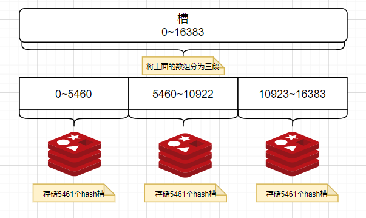

# Docker 进阶

## Docker 复杂安装 —— MySQL 主从搭建

### 主从复制原理

订阅binlog日志

### 搭建mysql集群

1.  启动master容器  
```bash
docker run -d -p 3306:3306 --privileged=true -v /tmp/mysql/master/log:/var/log/mysql -v /tmp/mysql/master/data:/var/lib/mysql -v /tmp/mysql/master/conf:/etc/mysql/conf.d -e MYSQL_ROOT_PASSWORD=123456 --name mysql-master mysql:5.7
```

2.  配置my.cnf  
```bash
[mysqld]
## 设置server_id 统一局域网中需要唯一
server_id = 100
## 指定不需要同步的数据库名称
binlog-ignore-db = mysql
## 开启二进制功能
log-bin = mall-mysql-bin
## 设置二进制日志使用内存大小（事务）
binlog_cache_size = 1M
## 设置使用的二进制日志格式（mixed,statement, row）
binlog_format = mixed
## 二进制日志过期清理时间，默认0，表示不自动清理
expire_logs_days = 7
## 跳过主从复制中遇到的所有错误或指定类型的错误，避免slave端复制中断
## e.g ： 
## 1062错误是指一些主键重复
## 1032错误是因为主从数据库数据不一致
slave_skip_errors = 1062
```

3.  重启master： `docker restart mysql-master` 
4.  master容器类进入MySQL：  
```bash
## 创建从库单独的账号和密码
CREATE USER 'slave'@'%' IDENTIFIED BY '123456';
## 授予从库账户权限
GRANT REPLICATION SLAVE,REPLICATION CLIENT ON *.* TO 'slave'@'%';
```

5.  创建从库  
```bash
docker run -d -p 3307:3306 --privileged=true -v /tmp/mysql/slave/log:/var/log/mysql -v /tmp/mysql/slave/data:/var/lib/mysql -v /tmp/mysql/slave/conf:/etc/mysql/conf.d -e MYSQL_ROOT_PASSWORD=123456 --name mysql-slave mysql:5.7
```

6.  配置从库my.cnf  
```bash
[mysqld]
## 设置server_id 统一局域网中需要唯一
server_id = 101
## 指定不需要同步的数据库名称
binlog-ignore-db = mysql
## 开启二进制功能,以备salve作为其他数据库实例的master时使用
log-bin = mall-mysql-slave1-bin
## 设置二进制日志使用内存大小（事务）
binlog_cache_size = 1M
## 设置使用的二进制日志格式（mixed,statement, row）
binlog_format = mixed
## 二进制日志过期清理时间，默认0，表示不自动清理
expire_logs_days = 7
## 跳过主从复制中遇到的所有错误或指定类型的错误，避免slave端复制中断
## e.g ： 
## 1062错误是指一些主键重复
## 1032错误是因为主从数据库数据不一致
slave_skip_errors = 1062
## relay_log 配置中继日志
relay_log = mall-mysql-relay-bin
## log_slave_updates表示slave将复制事件写入自己的二进制日志
log_slave_updates = 1
## slave 设置为只读（具有super权限的用户除外）
read_only = 1
```

7.  重启slave： `docker restart mysql-slave` 
8.  在master中查看主从同步状态： `show master status;`  
```bash
mysql> show master status;
+-----------------------+----------+--------------+------------------+-------------------+
| File                  | Position | Binlog_Do_DB | Binlog_Ignore_DB | Executed_Gtid_Set |
+-----------------------+----------+--------------+------------------+-------------------+
| mall-mysql-bin.000001 |      617 |              | mysql            |                   |
+-----------------------+----------+--------------+------------------+-------------------+
1 row in set (0.00 sec)
```

9.  进入slave容器  
```bash
## 1. 配置主从复制
## master_host 主机ip
## master_user     master中创建的同步账号
## master_password master 中创建的同步账号密码
## master_port     master 端口Position 
## master_log_file  show master status File 表示复制数据的日志文件
## master_log_pos   show master status Position 表示从哪个位置开始复制数据
## master_connect_retry  连接失败重试的时间间隔，单位秒
change master to master_host="172.16.0.11",
master_user='slave',
master_password=')3wq12q_9()1$7u',
master_port=3306,
master_log_file='mall-mysql-bin.000001',
master_log_pos=4613,
master_connect_retry=30;
## 2. 主从同步状态
## \G 表示 一列展示，不加则是以 table形式展示
show slave status \G;
## 3. 从库开启主从同步
start slave;
```

## Docker 复杂安装——redis亿条数据缓存设计

### 哈希取余分区

1.  执行方案
`hash(key) % N`,计算出哈希值，用以决定存储到哪个节点上。
 
2.  优点
实现简单，直接有效。 
3.  缺点
不利于redis集群的扩缩容，增加或者减少机器N都会随之改变，导致hash取余全部数据重新洗牌。 

### 一致性哈希算法分区

1.  是什么
为了在节点数目发生改变时尽可能**少的迁移数据**，将所有的存储节点排列在收尾相接的Hash环（)上，每个key在计算Hash 后会顺时针找到临接的存储节点存放。而当有节点加入或退 时，仅影响该节点在Hash环上顺时针相邻的后续节点。 
2.  能干什么 
   1. 提出一致性hash解决方案
   1. 当服务器扩缩容时尽量减少影响客户端到服务器的映射关系
3.  执行方案 
   1. 算法构建一致性哈希环
   1. 服务器IP节点映射
   1. key活到服务器的落键规则


4.  优点
   扩缩容时只影响哈希环中顺时针的方向的相邻节点的数，对其他无影响。 
   1. 提高了容错性 
      1. 收影响的数据仅仅时此台服务器到闭环中前一台服务器之间的数据。
   2. 提高了扩展性
5.  缺点
数据倾斜问题，数据存储分布不均匀
节点太少时，容易造成大量数据在某一（几）台服务器上。 

#### 哈希槽分区

1.  哈希槽是什么？
哈希槽实质是一个数组，数据[0, $2^{14}$-1]形成`hash slot`空间。 
2.  干什么？
解决数据倾斜的问题。在数据和节点之间增加一层，把这这层称谓哈希槽（slot），用于管理数据和节点之间的关系。
槽解决的是粒度问题，相当于把粒度变大了，这样便于数据移动。
 
3.  有多少个hash槽
一个集群只能由`16384`个槽，编号对应（0~ $2^{14}$-1），这些槽分配给集群中的所有主节点。每个key通过CRC16校验后再用16384取模来决定放置哪个槽中再放到对应节点中。`slot=CRC(key) % 16384`

```java
public static void main(String[] args) {
    System.out.println(SlotHash.getSlot("A"));// 6373  所以A落在node2上
}
```

1.  为什么是16384个槽？
CRC16算法产生hash值有16bit， 该算法可以产生``z^16 = 65536` 个值。那为什么选择16384呢？

资料参见：[https://github.com/redis/redis/issues/2576](https://github.com/redis/redis/issues/2576) 
1.  实验3主3从redis集权搭建
redis集群中，一个master挂了之后，在N次心跳之后slave变成master，之前的master复活之后变成slave。 
```bash
## 1. 同时创建6个redis容器
## -net host 使用宿主机的IP和端口，默认
## --appendonly yes 开启redis集群
## --port 6381 redis端口号
docker run -d --name redis-node-1 --net host --privileged=true -v /tmp/redis/node-1:/data redis:6.0.8 --cluster-enabled yes --appendonly yes --port 6381

docker run -d --name redis-node-2 --net host --privileged=true -v /tmp/redis/node-2:/data redis:6.0.8 --cluster-enabled yes --appendonly yes --port 6382

docker run -d --name redis-node-3 --net host --privileged=true -v /tmp/redis/node-3:/data redis:6.0.8 --cluster-enabled yes --appendonly yes --port 6383

docker run -d --name redis-node-4 --net host --privileged=true -v /tmp/redis/node-4:/data redis:6.0.8 --cluster-enabled yes --appendonly yes --port 6384

docker run -d --name redis-node-5 --net host --privileged=true -v /tmp/redis/node-5:/data redis:6.0.8 --cluster-enabled yes --appendonly yes --port 6385

docker run -d --name redis-node-6 --net host --privileged=true -v /tmp/redis/node-6:/data redis:6.0.8 --cluster-enabled yes --appendonly yes --port 6386

## 2. 进入任意一redis容器内(以6381为例)
docker exec -it redis-node-1 bash

## 3. 配置主从
##  --cluster-replicas 1 表示每个master 创建一个slave节点
redis-cli --cluster create 172.16.0.11:6381 172.16.0.11:6382 172.16.0.11:6383 172.16.0.11:6384 172.16.0.11:6385 172.16.0.11:6386 --cluster-replicas 1
## 确认
yes

## 创建成功输出
>>> Performing hash slots allocation on 6 nodes...
Master[0] -> Slots 0 - 5460
Master[1] -> Slots 5461 - 10922
Master[2] -> Slots 10923 - 16383
Adding replica 172.16.0.11:6385 to 172.16.0.11:6381
Adding replica 172.16.0.11:6386 to 172.16.0.11:6382
Adding replica 172.16.0.11:6384 to 172.16.0.11:6383
>>> Trying to optimize slaves allocation for anti-affinity
........
>>> Performing Cluster Check (using node 172.16.0.11:6381)
M: eb610be4091a6903492e8ef82e6b862b43d11da9 172.16.0.11:6381
   slots:[0-5460] (5461 slots) master
   1 additional replica(s)
S: 943696cae945b0740665c9432ad0a09683293508 172.16.0.11:6386
   slots: (0 slots) slave
   replicates eb610be4091a6903492e8ef82e6b862b43d11da9
M: d09926a58d1f78ca0b41e8b35602dcfa49078693 172.16.0.11:6382
   slots:[5461-10922] (5462 slots) master
   1 additional replica(s)
S: 955d9e72b52c1a6da7149cc81c64739984c3267e 172.16.0.11:6385
   slots: (0 slots) slave
   replicates 7b9f172347c192934d67a8351eda5589ec20d7c1
S: 4f88cbc87c825769ac3534018aa50a08c9a3b3b6 172.16.0.11:6384
   slots: (0 slots) slave
   replicates d09926a58d1f78ca0b41e8b35602dcfa49078693
M: 7b9f172347c192934d67a8351eda5589ec20d7c1 172.16.0.11:6383
   slots:[10923-16383] (5461 slots) master
   1 additional replica(s)
[OK] All nodes agree about slots configuration.
>>> Check for open slots...
>>> Check slots coverage...
[OK] All 16384 slots covered.
## 输出 END

## 4. 查看集群信息
redis-cli -p 6381
cluster info
## 5. 查看集群主从状态
cluster nodes

## 以集群方式连接redis
redis-cli -p 6381 -c
## 查看集群信息
redis-cli --cluster check 172.16.0.11:6381
```

6.  扩缩容 
   1.  扩容  
```bash
## 1. 启动需要新增的容器
docker run -d --name redis-node-7 --net host --privileged=true -v /tmp/redis/node-7:/data redis:6.0.8 --cluster-enabled yes --appendonly yes --port 6387

docker run -d --name redis-node-8 --net host --privileged=true -v /tmp/redis/node-8:/data redis:6.0.8 --cluster-enabled yes --appendonly yes --port 6388

## 2. 进入需要添加为 master 的容器内
docker exec -it redis-node-7 bash

## 3. 将该容器添加到集群中
## 将6387作为master添加到6381（也可以是集群中的其他master）的集群中
redis-cli --cluster add-node 172.16.0.11:6387 172.16.0.11:6381

## 4. 检查容器集群境况
redis-cli --cluster check 172.16.0.11:6381

####### result ###### 
## 发现 6387 尽管加入了集群但是并没有 获得槽
M: 882cf9b3d5347fba5bf92b4464bf5359b7647f29 172.16.0.11:6387
   slots: (0 slots) master
###### END ###### 

## 5. 重新分配槽号
redis-cli --cluster reshard 172.16.0.11:6381

###### CMD ######
[OK] All 16384 slots covered.
How many slots do you want to move (from 1 to 16384)? 【4096】
ID：【如上检查出来的 6387（需要加入集群的id） ID 882cf9b3d5347fba5bf92b4464bf5359b7647f29 】
ALL/DONE：【all】
Do you want to proceed with the proposed reshard plan (yes/no)? 【yes】
###### END ######

## 6. 再次检查集群
redis-cli --cluster check 172.16.0.11:6382

###### result ######
>>> Performing Cluster Check (using node 172.16.0.11:6382)
M: d09926a58d1f78ca0b41e8b35602dcfa49078693 172.16.0.11:6382
   slots:[6827-10922] (4096 slots) master
   1 additional replica(s)

## 不难发现 6387 的槽是由其他三个master 的槽的前部分 分给6387的#
## 如果全部重新分配槽，那么成本就非常的高了
M: 882cf9b3d5347fba5bf92b4464bf5359b7647f29 172.16.0.11:6387
   slots:[0-1364],[5461-6826],[10923-12287] (4096 slots) master

M: eb610be4091a6903492e8ef82e6b862b43d11da9 172.16.0.11:6381
   slots:[1365-5460] (4096 slots) master
   1 additional replica(s)
S: 943696cae945b0740665c9432ad0a09683293508 172.16.0.11:6386
   slots: (0 slots) slave
   replicates eb610be4091a6903492e8ef82e6b862b43d11da9
S: 955d9e72b52c1a6da7149cc81c64739984c3267e 172.16.0.11:6385
   slots: (0 slots) slave
   replicates 7b9f172347c192934d67a8351eda5589ec20d7c1
S: 4f88cbc87c825769ac3534018aa50a08c9a3b3b6 172.16.0.11:6384
   slots: (0 slots) slave
   replicates d09926a58d1f78ca0b41e8b35602dcfa49078693
M: 7b9f172347c192934d67a8351eda5589ec20d7c1 172.16.0.11:6383
   slots:[12288-16383] (4096 slots) master
   1 additional replica(s)
[OK] All nodes agree about slots configuration.
>>> Check for open slots...
>>> Check slots coverage...
[OK] All 16384 slots covered.
###### result ######

## 7. 将新添加的slaver添加到新增的master下
## 6389：slave | 6387：master
redis-cli --cluster add-node 172.16.0.11:6389 172.16.0.11:6387 --cluster-slave --cluster-master-id 882cf9b3d5347fba5bf92b4464bf5359b7647f29
```

   2.  缩容
步骤：①先删slave节点；②重新分配槽；③删除master节点；④停止容器  
```bash
## 1. 将slave节点删除
## redis-cli --cluster del-node 172.16.0.11:6389 6389节点ID
redis-cli --cluster del-node 172.16.0.11:6389 d9b60fbe4915aaddc44f333e6c95cb79ce4c9a5f

## 2. 重新分配槽号，将6387槽号清空
## 2.1 重新分配槽号的集群
redis-cli --cluster reshard 172.16.0.11:6381
## 2.2 将6387的槽号分配给 6381 
what is the recriving node ID: 【6381节点ID】
source node #1: 【6387节点ID】
source node #2: 【done】

## 3. 将6387从集群中移除
redis-cli --cluster del-node 172.16.0.11:6387 882cf9b3d5347fba5bf92b4464bf5359b7647f29

## 4. 检查集群情况
redis-cli --cluster check 172.16.0.11:6381

## 5. 停止容器
```

#### 存在问题数据倾斜

解决方案： 将redis服务器虚拟成N个点，分布再hash环上。


## 参考资料：
[1] 尚硅谷.哔哩哔哩.全新2022版Docker与微服务实战教程.2022[https://www.bilibili.com/video/BV1gr4y1U7CY](https://www.bilibili.com/video/BV1gr4y1U7CY)

[2] antirez.Github.redis为什么是16384个槽.2015[https://github.com/redis/redis/issues/2576](https://github.com/redis/redis/issues/2576)

[3]  架构精进之路.微信公众号.[一致性 Hash 算法原理&应用梳理]。2022(https://mp.weixin.qq.com/s/Urtm2K2XcBiius98wGK2TA)

