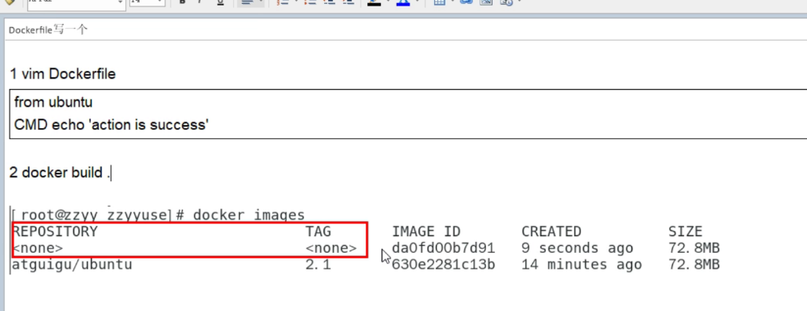
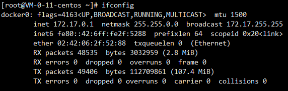
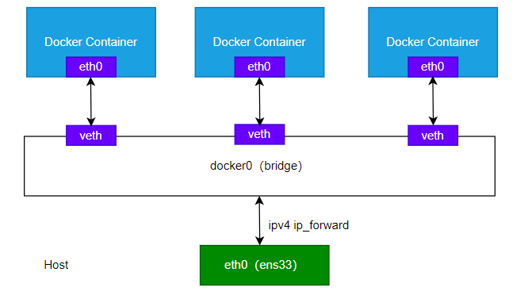
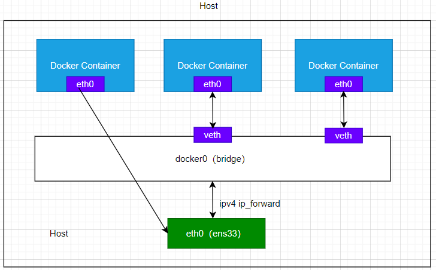
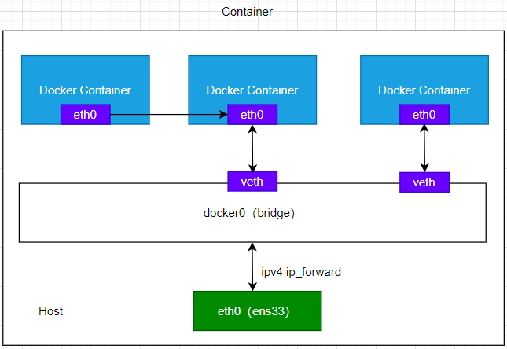

# Docker容器管理

## Dockerfile 解析

> dockerfile 是用来构建Docker镜像的文本文件，由N多构建镜像所需要的指令和参数构成的脚本。


### Dockerfile构建过程解析

dockerfile文档：[https://docs.docker.com/engine/reference/builder/](https://docs.docker.com/engine/reference/builder/)

**Dockerfile基础知识:**

1. 每个保留字指令**必须大写**且后面要紧跟  **≥ 1** 个参数
2. 指令从上到下执行
3. **#**表示注释
4. **每条**指令都会创建一个新的镜像层并对镜像进行提交

**Docker执行Dockerfile的大致流程：**

1. docker从基础镜像运行一个容器
2. 执行一条指令并对容器进行修改
3. 执行类似docker commit的操作提交一个新的镜像层
4. docker再基于刚提交的镜像运行一个新的容器
5. 执行dockerfile中的下一条指令直至全部完成

### Dockerfile实践

### Dockerfile常用关键字

参考资料：[https://registry.hub.docker.com/_/tomcat?tab=description](https://registry.hub.docker.com/_/tomcat?tab=description)

1.  FROM
基础镜像，指定一个已经存在的镜像作为模板，第一条必须是FROM 
2.  MAINTAINER
镜像维护者的姓名和邮箱地址 
3.  RUN 
   1.  容器构建的时候需要运行的命令 
   1.  编写方式 
      1.  shell方式  
```docker
## <命令行命令> 等同于在终端操作的shell命令
RUN <命令行命令>
## e.g:
## 等价与 yum -y install vim
RUN yum -y install vim
```
      2.  exec方式  
```docker
RUN[“可执行文件”,“参数1”,“参数1”]
## e.g
## 等价与 yum -y install vim
RUN ["yum","-y","install","vim"]
```

3.  RUN 是再docker build时运行 
4.  EXPOSE
当前容器对外暴露的端口 
5.  WORKDIR
创建容器后，终端默认登录进来的工作目录，一个落脚点  
```docker
## tomcat 
ENV CATALINA_HOME /usr/local/tomcat
WORKDIR $CATALINA_HOME
```

6.  USER
指定该镜像以什么样的用户去执行，默认root 
7.  ENV
dockerfile内的变量  
```docker
## tomcat
ENV CATALINA_HOME /usr/local/tomcat
ENV PATH $CATALINA_HOME/bin:$PATH
RUN mkdir -p "$CATALINA_HOME"
WORKDIR $CATALINA_HOME
```

8.  ADD 
将宿主机目录下的文件拷贝进镜像 且自动处理URL和 解压tar压缩包 
> 猜测 很多docker中包含的病毒就是这么来的

9.  COPY
类似ADD，拷贝文件和目录到镜像中  
```docker
## src 源文件/目录   dest 目标目录
##方式1（shell）
COPY sec dest
## 方式2（exec）
COPY ["src","dest"]
```

10.  VOLUME
容器数据卷，用于数据保存和持久化工作  
```docker
-v 宿主机目录:容器目录
```

11.  CMD 
   1. 指定容器启动后要干的事情 
      1. CMD的指定与RUN的类似 shell 和exec
   2. 注意事项 
      1. Dockerfile 中可以有**多个CMD指令**，但是只有**最后一个生效**，CMD会被**docker run之后**的**参数替换**
   3. 与RUN的区别 
      1. CMD是在docker run时运行
      1. RUN是在docker build时运行
12.  ENTRYPOINT 
   1. 用来指定一个容器启动时要运行的命令
   1. 类似与CMD指令，但是 ENTRYPOINT**不会被**docker run后的命令**覆盖**，而且这些命令**以参数**的**方式传给ENTRYPOINT**

### Dockerfile实操

1.  编写Dockerfile  
```docker

## 基础容器 
FROM centos
## 作者信息
MAINTAINER xxx<yyy@163.com>

## 定义变量
ENV LOCAL_PATH /usr/local
WORKDIR $LOCAL_PATH 

## 安装软件
RUN yum -y install vim
RUN yum -y install net-tools
RUN yum -y install glibc.i686
RUN mkdir /usr/lcoal/java

## 添加jdk安装包
ADD jdk-8u171-linux-x64.tar.gz /usr/local/java/

## jdk环境变量
ENV JAVA_HOME /usr/local/java/jdk-1.8.0_171
ENV JRE_HOME $JAVA_HOME/jre
ENV CLASSPATH $JAVA_HOME/lib/dt.jar:$JAVA_HOME/lib/tools.jar:$JAVA_HOME/lib:$CLASSPATH
ENV PATH $JAVA_PATH/bin:$PATH

CMD echo $LOCAL_PATH
CMD echo "success-------OK"
CMD /bin/bash
```

2.  build
**TAG 后边的. 一定要有**
`docker build -t 新镜像名称:TAG.` 
3.  run
`docker run -it 新镜像名称:TAG` 

### 虚悬镜像

> 在创建或者删除的一些错误导致仓库和标签都是null则会产生虚悬镜像；

自动创建一个虚悬镜像：



虚悬镜像已经失去价值，可以全部删除！

查询所有虚悬镜像：`docker image ls -f dangling=true`

删除所有虚悬镜像：`docker image prune`

## Docker 微服务实战

1.  编写好微服务后 maven 打包成jar 
2.  编写Dockerfile  
```docker
## 基础镜像
FROM java:8
## 作者信息
MAINTAINER xxx<yyy@163.com>
## VOLUME 指定临时文件目录为tmp，
## 在主机/var/lib/docker目录下常见一个临时文件并链接到有容器的/tmp
VOLUME /tmp
## ADD 将jar 添加到容器中 并重命名
ADD docker_boot-0.0.1-SHAPSHOT.jar docker_boot.jar
## 运行jar文件
RUN bash -c 'touch /docker_boot.jar'
ENTRYPOINT ["java","-jar","./docker_boot.jar"]
## 向外暴露端口
EXPOSE 8080
```

3.  构建
`docker build -t docker-boot:1.0.0 .` 
4.  运行
`docker run -d -p 8082:8082 docker-boot:1.0.0` 

## Docker 网络

docker启动后 linux会创建一个docker0 的虚拟网桥

docker0 是与虚拟机和容器、容器和容器间的通讯作用


### docker网络模式

docker容器内部IP每次启动会重新分配IP。

docker会默认创建4大网络模式

1.  bridge：为每个容器分配设置IP等，并将容器连接到docker0（虚拟网桥默认模式）
使用：—network bridge 指定，默认

2.  host：容器将不会虚拟出自己的网卡、配置IP等，而是直接使用宿主机的IP和端口
使用：—network host 指定
 
3.  none：容器有独立的network namespace，但并没有对网络设置，比如veth pair和网桥连接、ip;
**禁用网络功能**，只有lo标识，一般不用
使用：—network none 指定 
4.  container：新建的容器不会创建自己的网卡和配置自己的IP，而是和一个指定的容器共享IP、端口范围等
不适用于对外发布的容器（因为端口会冲突）
依赖的container关闭之后则当前容器网络也会断开
使用：—network container:NAME或容器ID 指定

5.  自定义网络
解决的痛点：解决容器间的网络IP不固定问题，搭建之后则可以使用对方容器名进行调用。
自定义网络本身就维护好了主机名和ip的对应关系（ip和域名都能通）  
```bash
## 1. 创建自己的网络（默认bridge模式）
docker network create diy_network

## 2. 启用两台tomcat测试
docker run -d -p 8080:8080 --network diy_network --name tomcat80 tomcat

docker run -d -p 8081:8080 --network diy_network --name tomcat81 tomcat

## 3. 进入容器 
docker exec -it tomcat80 bash

## 4. ping 81的网络 且能ping通
ping tomcat81
```

### 常用命令

```bash
## 查看docker所有网卡列表
docker netword ls

## 查看网络源数据 查询最后20行数据
docker network inspect xxx网络名字|tail -n 20

## 创建网络
docker network create xxx网络名字
## 删除网络
docker netword rm xxx网络名字

## 查看bridge网络
docker network inspect bridge
```

## Docker-compose 容器编排

### 是什么

实现docker容器集群的快速编排

### 能干嘛

docker-compose可以实现多服务部署

docker-compose是解决容器之间的如何编排（各个容器的启动顺序）

### 安装

文档：[https://docs.docker.com/compose/compose-file/compose-file-v3/](https://docs.docker.com/compose/compose-file/compose-file-v3/)

官网安装文档： [https://docs.docker.com/compose/install/](https://docs.docker.com/compose/install/)

安装步骤：

```bash
## 1. 下载compose
sudo curl -L "https://github.com/docker/compose/releases/download/1.29.2/docker-compose-$(uname -s)-$(uname -m)" -o /usr/local/bin/docker-compose
## 2. 添加权限
sudo chmod +x /usr/local/bin/docker-compose
## 3. 验证
docker-compose --version

## 4. 卸载
sudo rm /usr/local/bin/docker-compose
```

### docker compose核心概念

1.  1个文件
docker-compose.yml 
2.  2个要素 
   1. 服务：一个个的容器
   1. 工程：一组相关联的容器组成一个**完整业务单元**，在docker-compose.yml中定义

### docker compose 常用命令

```bash
## 查看帮助
docker-compose -h
## 启动所有docker-compose服务 
docker-compose up
### 启动所有docker-compose 服务并后台启动
docker-compose up -d
### 停止并删除容器、网络、卷、镜像
docker-compose down
## 进入容器实例内部 docker-compose exec docker-compose.yml文件中写的服务ID /bin/bash
docker-compose exec yml里面写的服务ID
## 展示当前docker-compose编排过的运行的所有容器
docker-compose ps
## 展示当前docker-compose编排过的容器进程
docker-compose top

## 查看容器日志
docker-compose logs yml内写的服务ID
## 检查配置
docker-compose config
## 检查配置 有问题才输出
docker-compose config -q
## 重启服务
docker-compose restart
## 启动服务
docker-compose start
## 停止服务
docker-compose stop
```

### docker-compose 实操

针对几十个容器（过多或者N多集群那么请使用K8S

不使用compose的缺点：

1.  有N个容器则需要写N个run 
2.  启动顺序难以保证 
3.  容器间的启动或者宕机，可能导致IP更改，导致映射出错 
4.  **docker-compose编写：**  
```yaml
version: "3"
services:
  microService:
    image: zzyy_docker:1.6
		## -name
    container_name: ms01
    ports:
      - "6001:6001"
    volumes:
      - /app/microService:/data
    networks: 
      - atguigu_net 
    depends_on: 
      - redis
      - mysql
  redis:
    image: redis:6.0.8
    ports:
      - "6379:6379"
    volumes:
      - /app/redis/redis.conf:/etc/redis/redis.conf
      - /app/redis/data:/data
    networks: 
      - atguigu_net
    command: redis-server /etc/redis/redis.conf
  mysql:
    image: mysql:5.7
    environment:
      MYSQL_ROOT_PASSWORD: '123456'
      MYSQL_ALLOW_EMPTY_PASSWORD: 'no'
      MYSQL_DATABASE: 'db2021'
      MYSQL_USER: 'zzyy'
      MYSQL_PASSWORD: 'zzyy123'
    ports:
       - "3306:3306"
    volumes:
       - /app/mysql/db:/var/lib/mysql
       - /app/mysql/conf/my.cnf:/etc/my.cnf
       - /app/mysql/init:/docker-entrypoint-initdb.d
    networks:
      - atguigu_net
    command: --default-authentication-plugin=mysql_native_password #解决外部无法访问
networks: 
   atguigu_net:
```

5.  **项目yml修改**：
采用服务名连接  
```yaml
#spring.datasource.url=jdbc:mysql://192.168.111.169:3306/db2021?useUnicode=true&characterEncoding=utf-8&useSSL=false
spring.datasource.url=jdbc:mysql://mysql:3306/db2021?useUnicode=true&characterEncoding=utf-8&useSSL=false

#spring.redis.host=192.168.111.169
spring.redis.host=redis
```

6.  启动  
```bash
## 检查compose文件
docker-compose config -q
## 执行 
docker-compose up
## 或者执行
docker-compose up -d
```

7.  注意事项
compose中没有指定container_name 或者网络名称 那么启动之后为自动加一个路径前缀和数字后缀。 

## Docker 轻量化可视化工具 Portainer

### 是什么

用于方便地管理Docker环境，包括单机环境和集群环境。

### 安装

```bash
## 拉取portainer
docker pull portainer/portainer

## 跑起来
## --restart=always docker已启动 我就自动起来
docker run -d -p 8000:8000 -p 9000:9000 --name portainer --restart=always -v /var/run/docker.sock:/var/run/docker.sock -v portainer_data:/data  portainer/portainer
```

## Docker 容器监控之 CAdvisor + InfluxDB + Granfana

重量级监控工具

1.  compose配置  
```yaml
version: '3.1'
volumes:
  grafana_data: {}
services:
 influxdb:
  image: tutum/influxdb:0.9
  restart: always
  environment:
    - PRE_CREATE_DB=cadvisor
  ports:
    - "8083:8083"
    - "8086:8086"
  volumes:
    - ./data/influxdb:/data
 cadvisor:
  image: google/cadvisor
  links:
    - influxdb:influxsrv
  command: -storage_driver=influxdb -storage_driver_db=cadvisor -storage_driver_host=influxsrv:8086
  restart: always
  ports:
    - "8080:8080"
  volumes:
    - /:/rootfs:ro
    - /var/run:/var/run:rw
    - /sys:/sys:ro
    - /var/lib/docker/:/var/lib/docker:ro
 grafana:
  user: "104"
  image: grafana/grafana
  user: "104"
  restart: always
  links:
    - influxdb:influxsrv
  ports:
    - "3000:3000"
  volumes:
    - grafana_data:/var/lib/grafana
  environment:
    - HTTP_USER=admin
    - HTTP_PASS=admin
    - INFLUXDB_HOST=influxsrv
    - INFLUXDB_PORT=8086
    - INFLUXDB_NAME=cadvisor
    - INFLUXDB_USER=root
    - INFLUXDB_PASS=root
```

2.  启动 `docker-compose up` 


##  参考资料：
[1]尚硅谷.哔哩哔哩.全新2022版Docker与微服务实战教程：[https://www.bilibili.com/video/BV1gr4y1U7CY](https://www.bilibili.com/video/BV1gr4y1U7CY)

[2] Dockerfile doc：[https://docs.docker.com/engine/reference/builder/](https://docs.docker.com/engine/reference/builder/)

[3] docker network：[https://docs.docker.com/network/](https://docs.docker.com/network/links/)

[4] compose文档：[https://docs.docker.com/compose/compose-file/compose-file-v3/](https://docs.docker.com/compose/compose-file/compose-file-v3/)

[5] compose官网安装文档： [https://docs.docker.com/compose/install/](https://docs.docker.com/compose/install/)

[6] Portainer官网：[https://www.portainer.io/](https://www.portainer.io/)

