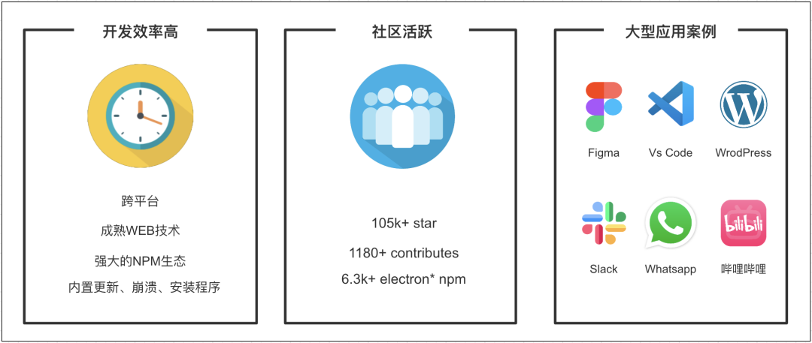
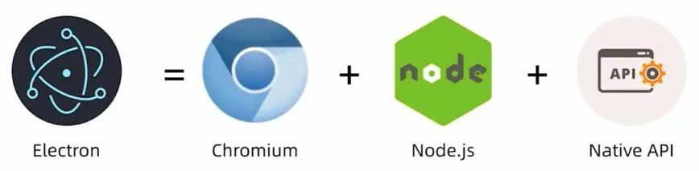
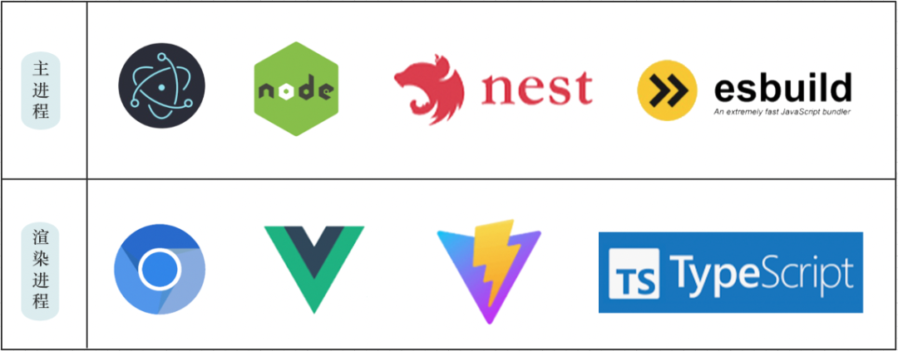
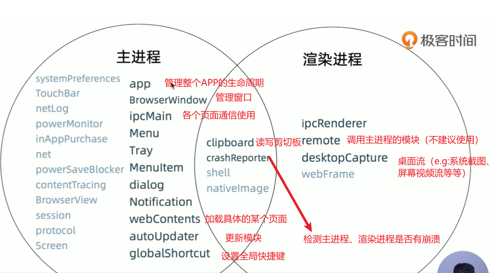
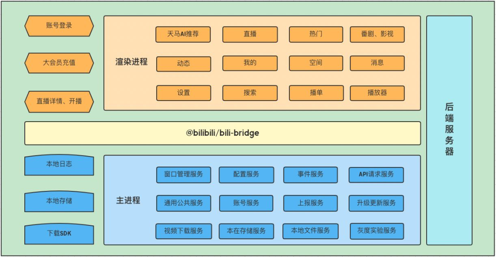
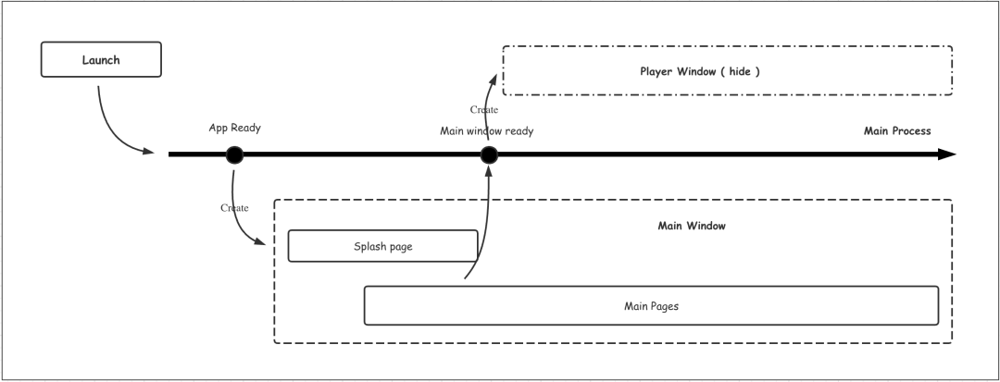
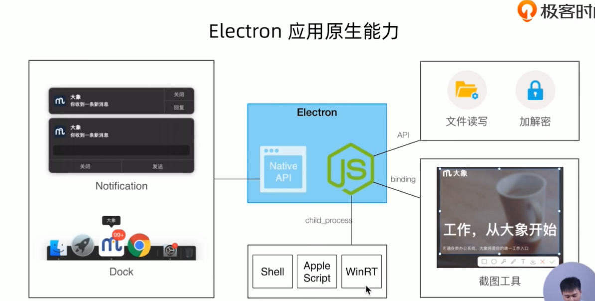
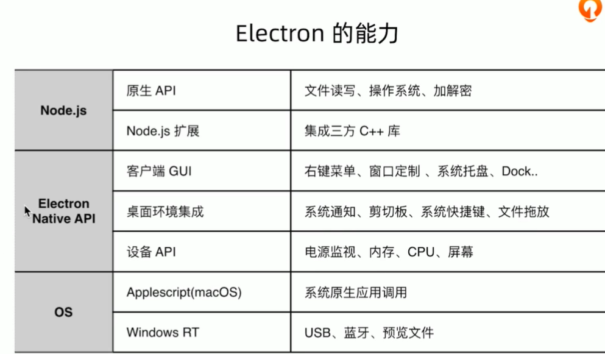

## 桌面端的技术选型

主流的桌面端技术对比：

图1

Electron的优势

图2

Electron的构成

图3

Electron程序主要分为主进程(Main Process)和渲染进程(Render Process)。

主进程主要为NodeJs和原生API，渲染进程主要为前端技术，主进程和渲染进程之间通过IPC进行通信。

Bilibili主要采取的技术栈来编写客户端：

图四

主进程与渲染进程的模块介绍：

图五

Bilibili客户端架构：

图六

Bilibili客户端执行流程：

图七

采用隐藏的窗口进程做预渲染和并行处理是提升Electron应用体验的常用方法，在Electron中可以用ChildProcess、BrowserWindow、BrowserView、webview等方式开启子进程，突破进程限制，充分利用机器的性能。

## 参考资料

[1] 沈涛.微信公众平台.哔哩哔哩技术.B站PC客户端-架构设计.https://mp.weixin.qq.com/s/8kmNnHe5NV5FXRW4Ayz4bg. 2023.03.31

[2]邓耀龙.极客时间.Electron 开发实战.https://time.geekbang.org/course/intro/100044201
