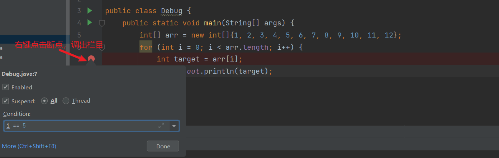

# IDEA 快捷键设置

设置 `file→ setting → Keymap →` 

## 设置关闭窗口 active Tab

`Main Menu→ Window → Editer Tabs` 

| close  | 关闭当前窗口 |
| --- | --- |
| Close All Tabs  | 关闭所有窗口 |
| select Next Tab | 切换到下一个窗口（向右） |
| Select Previous Tab | 切换到前一个窗口（向左） |
| Split Right | 分割窗口（向右） |

## 设置关闭左边导航 active Tab

`Main Menu→ Window → Active Tool Window`

| Close Active Tab | 关闭左侧导航 |
| --- | --- |

## 查找代码

`Main Menu→ Navigate →` 

| back | 上一个方法，往回找 |
| --- | --- |
| Forword | 返回上一个，往前找 |
| Go to Declaration or Usages | 进入方法内部 |
| Go to Implementation(s) | 进入实现类 |

## 提升编码效率

提高编写速度（上）

| 说明  | 快捷键 |
| --- | --- |
| 智能提示-edit  | alt + enter |
| 提示代码模板-insert live template  | ctrl+j |
| 使用xx块环绕-surround with ...  | ctrl+alt+t |
| 调出生成getter/setter/构造器等结构-generate ...  | alt+insert |
| 自动生成返回值变量-introduce variable ...  | ctrl+alt+v |
| 复制指定行的代码-duplicate line or selection |  ctrl+d |
| 删除指定行的代码-delete line  | ctrl+y |
| 切换到下一行代码空位-start new line  | shift + enter |
| 切换到上一行代码空位-start new line before current  | ctrl +alt+ enter |
| 向上移动代码-move statement up |  ctrl+shift+↑ |
| 向下移动代码-move statement down |  ctrl+shift+↓ |
| 向上移动一行-move line up |  alt+shift+↑ |
| 向下移动一行-move line down |  alt+shift+↓ |
| 方法的形参列表提醒-parameter info  | ctrl+p |

提高编写速度（下）

| 说明 |  快捷键 |
| --- | --- |
| 批量修改指定的变量名、方法名、类名等-rename  | shift+f6 |
| 抽取代码重构方法-extract method ...  | ctrl+alt+m |
| 重写父类的方法-override methods ...  | ctrl+o |
| 实现接口的方法-implements methods ...  | ctrl+i |
| 选中的结构的大小写的切换-toggle case  | ctrl+shift+u |
| 批量导包-optimize imports  | ctrl+alt+o |

## 类结构、查找和查看源码

| 说明 |  快捷键 |
| --- | --- |
| 如何查看源码-go to class...  | ctrl + 选中指定的结构 或 ctrl+n |
| 显示当前类结构，支持搜索指定的方法、属性等-file structure |  ctrl+f12 |
| 退回到前一个编辑的页面-back  | ctrl+alt+← |
| 进入到下一个编辑的页面-forward  | ctrl+alt+→ |
| 打开的类文件之间切换-select  | previous/next tab alt+←/→ |
| 光标选中指定的类，查看继承树结构-Type Hierarchy  | ctrl+h |
| 查看方法文档-quick documentation |  ctrl+q |
| 类的UML关系图-show uml popup |  ctrl+alt+u |
| 定位某行-go to line/column  | ctrl+g |
| 回溯变量或方法的来源-go to implementation(s)  | ctrl+alt+b |
| 折叠方法实现-collapse all  | ctrl+shift+ - |
| 展开方法实现-expand all  | ctrl+shift+ + |

## 调整格式

| 说明 |  快捷键 |
| --- | --- |
| 格式化代码-reformat code  | ctrl+alt+l |
| 使用单行注释-comment with line comment  | ctrl + / |
| 使用/取消多行注释-comment with block comment  | ctrl + shift + / |
| 选中数行，整体往后移动-tab | tab |
| 选中数行，整体往前移动-prev tab | shift + tab |

## Debug

### 条件断点

> 适用场景：
比如，边循环处理批量数据的时候（比如100个元素），其中在处理中间某一个元素的时候报错（比如第50的一个元素），我们该怎样的定位到该元素呢？此时条件断点的功能就显现了。
> 

```java
public class Debug {
  public static void main(String[] args) {
    int[] arr = new int[]{1,2,3,4,5,6,7,8,9,10,11,12};
    for (int i = 0; i < arr.length; i++) {
      int target = arr[i];
      System.out.println(target);
   }
 }
}
```

我们需要一次性定位到 5 的位置；



## 参考资料：

[1] 宋红康.尚硅谷.哔哩哔哩.IDEA2022全新版教程，兼容JDK17（快速上手Java开发利器）.2022 [https://www.bilibili.com/video/BV1CK411d7aA?p=13](https://www.bilibili.com/video/BV1CK411d7aA?p=13)